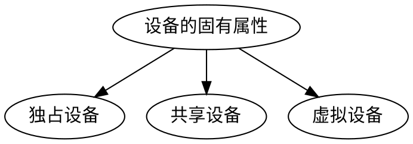
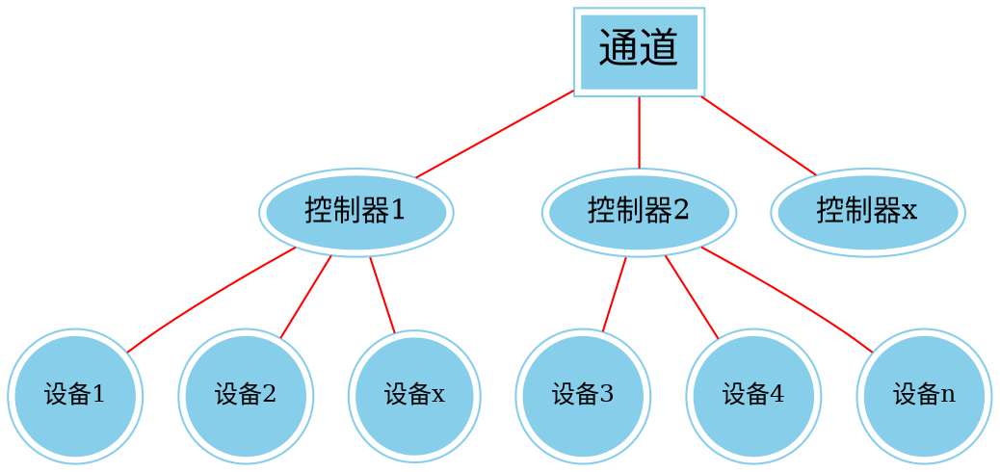
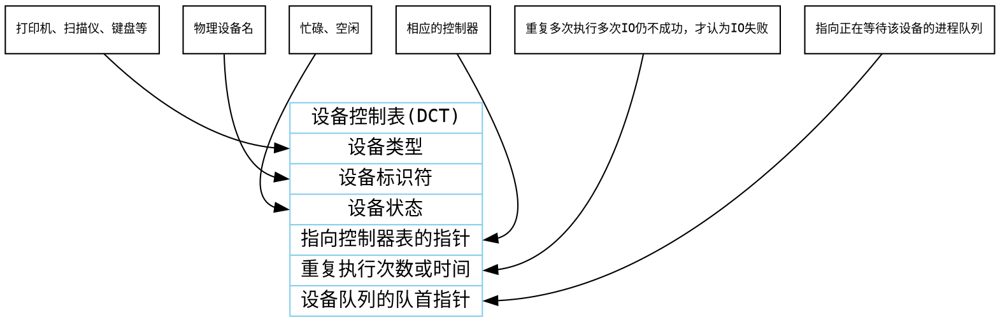
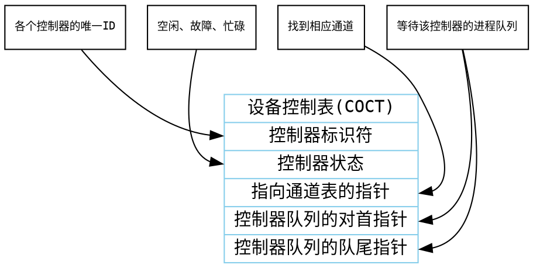
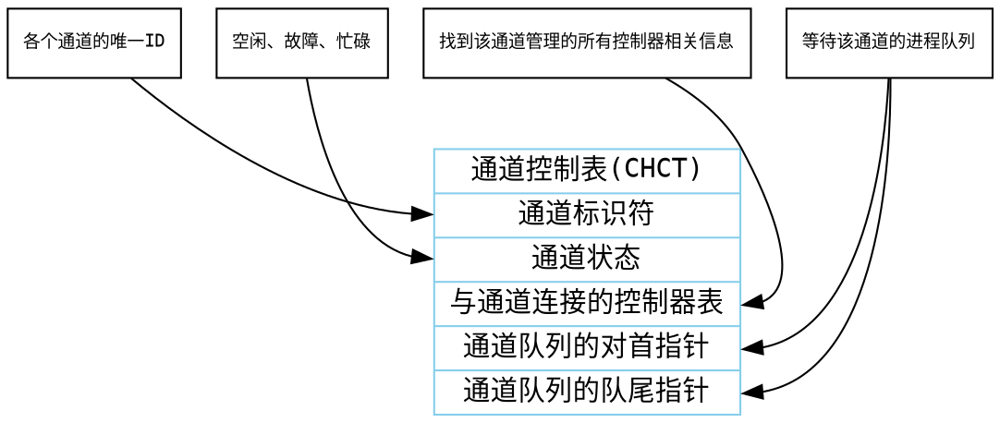
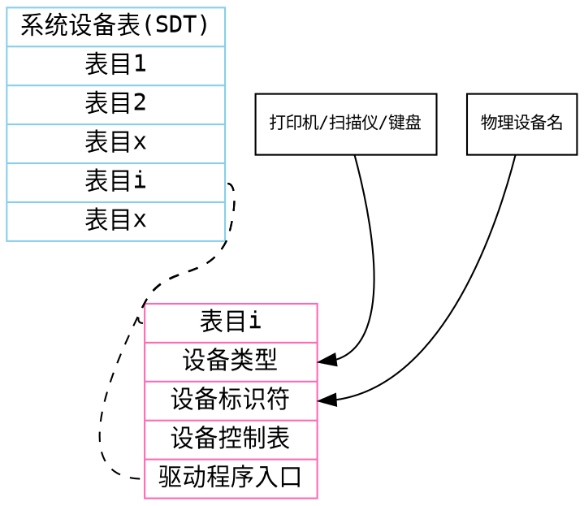

# 设备的分配与回收
**作者** : **m0dulo**
**2019/10/18**
[toc]

## 一、设备分配时考虑的因素
### 1.1设备的固有属性

* **独占设备**：一个时段只能分配给一个进程（如打印机）
* **共享设备**：可同时分配给多个进程使用（如磁盘），各进程往往时宏观上同时共享使用设备，而微观上交替使用
* **虚拟设备**：采用SPOOLing技术将独占设备改造成虚拟的共享设备，可同时分配给多个进程使用（如采用SPOOLing技术实现的共享打印机）
### 1.2设备分配算法
* **先来先服务**
* **优先级高者优先**
* **短任务优先**
**......**
### 1.3设备分配的安全性
#### 安全分配方式
为进程分配一个设备后就将进程阻塞，本次I/O完成后才将进程唤醒，也即**一个时段内每个进程只能使用一个设备**（eg:打印机输出的例子）
##### 优点
破坏了“请求和保持条件”，不会死锁
##### 缺点
对于一个进程来说，CPU和I/O设备只能串行工作
#### 不安全分配方式
进程发出I/O请求后，系统为其分配I/O，进程可继续执行，之后还可以发出新的I/O请求。周有某个I/O请求得不到满足时才讲进程阻塞。也即**一个进程可以同时使用多个设备**
##### 优点
进程的计算任务和I/O任务可以并行处理，使进程迅速推进
##### 缺点
有可能发生死锁

## 二、静态分配与动态分配
### 2.1静态分配
进程运行前为其分配全部所需资源，运行结束后归还资源（破坏了“请求和保持条件”，不会发生死锁）
### 2.2动态分配
进程运行过程中动态申请设备资源

## 三、设备分配管理中的数据结构
### 3.1 设备、控制器、通道之间的关系

### 3.2设备控制表（DCT）
* 系统为每个设备配置一张DCT，用于记录设备情况

* **注**：系统会根据阻塞原因不同，将进程PCB挂到不同的阻塞队列中

### 3.3控制器控制表（COCT）
* 每个设备控制器都会对应一张COCT。操作系统根据COCT的信息对控制器进行操作和管理

### 3.4通道控制表(CHCT)
* 对通道进行操作和管理

### 3.5系统设备表（SDT）
记录了**系统中全部设备**的情况，每个设备对应一个表目。

## 四、设备分配算法
①根据进程请求的**物理设备名**查找SDT
②根据SDT找到DCT，若**设备**忙碌则讲进程PCB挂到**设备等待队列**中，不忙碌则将**设备**分配给进程
③根据DCT找到COCT，若**控制器**忙碌则将进程PCB挂到**控制器等待队列**中，不忙碌则将**控制器**分配给进程。
④根据COCT找到CHCT，若**通道**忙碌则将PCB挂到**通道等待队列**中，不忙碌则将**通道**分配给进程。

* **缺点**
① 编程时必须使用“物理设备名”，不方便用户使用
② 若换了一个物理设备，则程序无法运行
③ 若进程请求的物理设备正在忙碌，则即使系统中还有同类型的设备，进程也必须阻塞等待

## 五、设备分配算法的改进
### 5.1算法
① 根据进程请求的**逻辑设备名**查找SDT（**注：用户编程时提供的逻辑设备名其实就是“设备类型”**）
② 查找SDT，找到用户进程**指定类型的、并且空闲**的设备，讲其分配给该进程，操作系统在**逻辑设备表（LUT）中新增一个表项**
③根据DCT找到COCT，若**控制器**忙碌则将进程PCB挂到**控制器等待队列**中，不忙碌则将**控制器**分配给进程。
④根据COCT找到CHCT，若**通道**忙碌则将PCB挂到**通道等待队列**中，不忙碌则将**通道**分配给进程。
### 5.2逻辑设备表
逻辑设备名|物理设备名|驱动程序入口地址
-|-|-
/dev/priter|3|1024
/dev/tty|5|2016
...|...|...

**逻辑设备表（LUT）建立了逻辑设备名与物理设备名之间的映射关系**
某用户进程第一次使用设备时使用逻辑设备名向操作系统发出请求，操作系统根据用户进程指定的设备类型（逻辑设备名）查找系统设备表，找到一个空闲的设备分配给进程，并在LUT中增加相应的表项
**如果之后用户进程再次通过相同的逻辑设备名请求使用设备，则操作系统通过LUT即可知道用户进程实际要用的时哪个物理设备了，并且也知道该设备的驱动程序入口地址**