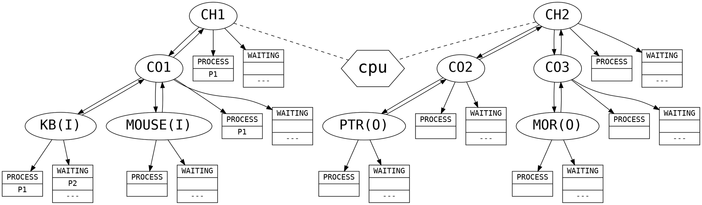
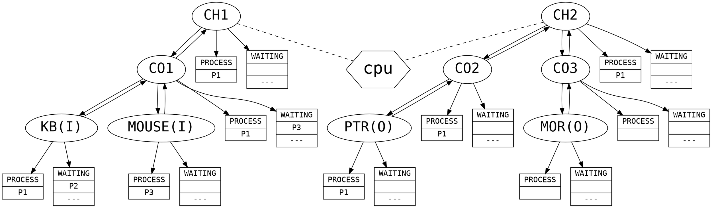
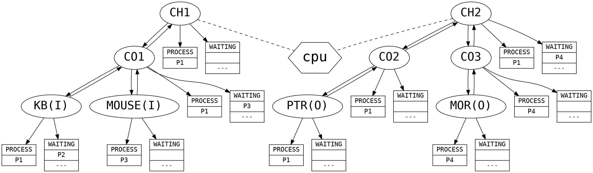
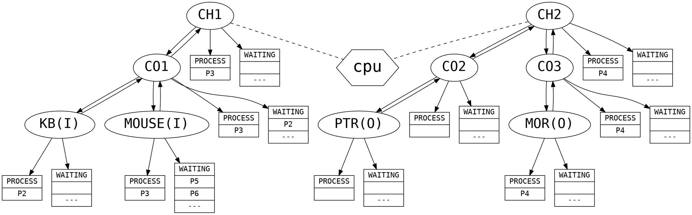
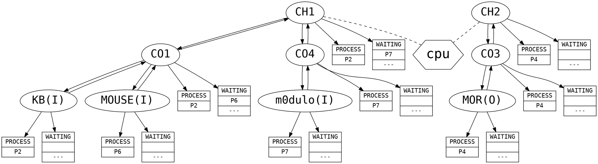

[toc]

#initial status

# a KB P1

# a KB P2

# a MOUSE P3

# a PTR P1

# a MOR P4

# r KB

# t P1

# a MOUSE P5

# a MOUSE P6

# r MOUSE

# a PTR P5

# t P5

# c m0dulo I  Y CO4 CH1

```dot
digraph G {
   node [fontname = "Consolas"]
   CPU[shape = "hexagon",label="cpu",fontsize = 30]

   CH1[label="CH1",fontsize = 25]
   CH2[label="CH2",fontsize = 25]

   CO1[label="CO1",fontsize = 25]
   CO2[label="CO2",fontsize = 25]
   CO3[label="CO3",fontsize = 25]
   CO4[label="CO4", fontsize = 25]

   KB[label="KB(I)",fontsize = 25]
   MO[label="MOUSE(I)",fontsize = 25]
   PTR[label="PTR(O)",fontsize = 25]
   MOR[label="MOR(O)",fontsize = 25]
   m0dulo[label="m0dulo(I)", fontsize = 25]

   CH1P[shape = "record", label="{PROCESS|P2}"]
   CH2P[shape = "record", label="{PROCESS|P4}"]
   CO1P[shape = "record", label="{PROCESS|P2}"]
   CO2P[shape = "record", label="{PROCESS|}"]
   CO3P[shape = "record", label="{PROCESS|P4}"]
   CO4P[shape = "record", label = "{PROCESS|}"]
   KBP[shape = "record", label="{PROCESS|P2}"]
   MOP[shape = "record", label="{PROCESS|P6}"]
   PTRP[shape = "record", label="{PROCESS|}"]
   MORP[shape = "record", label="{PROCESS|P4}"]
   m0duloP[shape = "record", label = "{PROCESS|}"]

    CH1B[shape = "record", label = "{WAITING||---}"]
    CH2B[shape = "record", label = "{WAITING||---}"]
    CO1B[shape = "record", label = "{WAITING|P6|---}"]
    CO2B[shape = "record", label = "{WAITING||---}"]
    CO3B[shape = "record", label = "{WAITING||---}"]
    CO4B[shape = "record", label = "{WAITING||---}"]
    KBB[shape = "record", label = "{WAITING||---}"]
    MOB[shape = "record", label = "{WAITING||---}"]
    PTRB[shape = "record", label = "{WAITING||---}"]
    MORB[shape = "record", label = "{WAITING||---}"]
    m0duloB[shape = "record", label = "{WAITING||---}"]

   KB -> CO1
   CO1 -> KB

   MO -> CO1
   CO1 -> MO

   PTR -> CO2
   CO2 -> PTR

   MOR -> CO3
   CO3 -> MOR

   m0dulo -> CO4
   CO4 -> m0dulo

   CO1 -> CH1
   CH1 -> CO1

   CO2 -> CH2
   CH2 -> CO2

   CO3 -> CH2
   CH2 -> CO3

   CO4 -> CH1
   CH1 -> CO4

   CH1 -> CPU [style=dashed,dir=none]
   CH2 -> CPU [style=dashed,dir=none]

    
    CH1 -> CH1P
    CH2 -> CH2P
    CO1->CO1P
    CO2 -> CO2P
    CO3 -> CO3P
    CO4 -> CO4P
    KB->KBP
    MO->MOP
    PTR->PTRP
    MOR->MORP
    m0dulo -> m0duloP

    CH1 -> CH1B
    CH2 -> CH2B
    CO1 -> CO1B
    CO2 -> CO2B
    CO3 -> CO3B
    CO4 -> CO4B
    KB -> KBB
    MO -> MOB
    PTR -> PTRB
    MOR -> MORB
    m0dulo -> m0duloB
}
```

# i I P7

```dot
digraph G {
   node [fontname = "Consolas"]
   CPU[shape = "hexagon",label="cpu",fontsize = 30]

   CH1[label="CH1",fontsize = 25]
   CH2[label="CH2",fontsize = 25]

   CO1[label="CO1",fontsize = 25]
   CO2[label="CO2",fontsize = 25]
   CO3[label="CO3",fontsize = 25]
   CO4[label="CO4", fontsize = 25]

   KB[label="KB(I)",fontsize = 25]
   MO[label="MOUSE(I)",fontsize = 25]
   PTR[label="PTR(O)",fontsize = 25]
   MOR[label="MOR(O)",fontsize = 25]
   m0dulo[label="m0dulo(I)", fontsize = 25]

   CH1P[shape = "record", label="{PROCESS|P2}"]
   CH2P[shape = "record", label="{PROCESS|P4}"]
   CO1P[shape = "record", label="{PROCESS|P2}"]
   CO2P[shape = "record", label="{PROCESS|}"]
   CO3P[shape = "record", label="{PROCESS|P4}"]
   CO4P[shape = "record", label = "{PROCESS|P7}"]
   KBP[shape = "record", label="{PROCESS|P2}"]
   MOP[shape = "record", label="{PROCESS|P6}"]
   PTRP[shape = "record", label="{PROCESS|}"]
   MORP[shape = "record", label="{PROCESS|P4}"]
   m0duloP[shape = "record", label = "{PROCESS|P7}"]

    CH1B[shape = "record", label = "{WAITING|P7|---}"]
    CH2B[shape = "record", label = "{WAITING||---}"]
    CO1B[shape = "record", label = "{WAITING|P6|---}"]
    CO2B[shape = "record", label = "{WAITING||---}"]
    CO3B[shape = "record", label = "{WAITING||---}"]
    CO4B[shape = "record", label = "{WAITING||---}"]
    KBB[shape = "record", label = "{WAITING||---}"]
    MOB[shape = "record", label = "{WAITING||---}"]
    PTRB[shape = "record", label = "{WAITING||---}"]
    MORB[shape = "record", label = "{WAITING||---}"]
    m0duloB[shape = "record", label = "{WAITING||---}"]

   KB -> CO1
   CO1 -> KB

   MO -> CO1
   CO1 -> MO

   PTR -> CO2
   CO2 -> PTR

   MOR -> CO3
   CO3 -> MOR

   m0dulo -> CO4
   CO4 -> m0dulo

   CO1 -> CH1
   CH1 -> CO1

   CO2 -> CH2
   CH2 -> CO2

   CO3 -> CH2
   CH2 -> CO3

   CO4 -> CH1
   CH1 -> CO4

   CH1 -> CPU [style=dashed,dir=none]
   CH2 -> CPU [style=dashed,dir=none]

    
    CH1 -> CH1P
    CH2 -> CH2P
    CO1->CO1P
    CO2 -> CO2P
    CO3 -> CO3P
    CO4 -> CO4P
    KB->KBP
    MO->MOP
    PTR->PTRP
    MOR->MORP
    m0dulo -> m0duloP

    CH1 -> CH1B
    CH2 -> CH2B
    CO1 -> CO1B
    CO2 -> CO2B
    CO3 -> CO3B
    CO4 -> CO4B
    KB -> KBB
    MO -> MOB
    PTR -> PTRB
    MOR -> MORB
    m0dulo -> m0duloB
}
```

# d PTR

